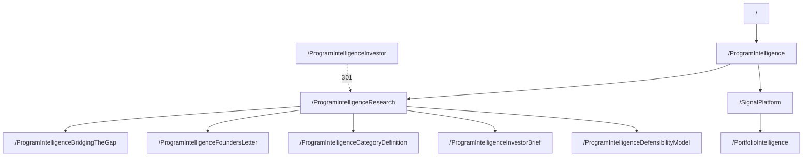

# Program Intelligence Research Overlap Resolution

**Report date:** 2026-03-15 (Asia/Dubai)

## Executive summary

You have two overlapping artifacts because they are both trying to do “the intro to Program Intelligence,” but they serve **different user jobs**:

- **Artifact A** (“Program Intelligence: Bridging the Gap Between Engineering Execution and Executive Decision‑Making”) is a **single long-form research paper** and should live on its own stable, citable URL with paper UX conventions (TOC/in-page links, document metadata, related papers). citeturn4view4turn1search5  
- **Artifact B** (currently **`/ProgramIntelligenceInvestor`**, “Program Intelligence — The Execution Observability Discipline”) is functioning as a **research hub preface** that routes readers into the Founder’s Letter and other papers. It should be the hub intro, not a competing “paper-ish” page.

**Two canonical anchors you should enforce:**
- **Research hub (canonical):** **`/ProgramIntelligenceResearch`**
- **Whitepaper A (canonical):** **`/ProgramIntelligenceBridgingTheGap`**

**Top actions (in priority order):**
1. Convert **`/ProgramIntelligenceResearch`** into the **Research Hub** and place the **“Execution Observability Discipline”** intro + model diagram there (Artifact B content moves here).  
2. Move the full whitepaper (Artifact A) to **`/ProgramIntelligenceBridgingTheGap`** and format it like a paper (TOC + “Back to Research” + “Related Research”). citeturn4view4turn1search5turn9view1  
3. 301 redirect **`/ProgramIntelligenceInvestor` → /ProgramIntelligenceResearch`** using server-side permanent redirects. citeturn5view1  
4. Remove sales-oriented CTAs from research pages; replace with **“Back to Research”** and **“Related Research”** blocks that sit immediately after the article end. citeturn9view1turn3view4  
5. Implement canonicals + sitemap containing **only canonical URLs**, and keep all internal links consistently pointing to the canonical PascalCase URLs. citeturn3view0turn6view0turn3view3  

Unspecified implementation details (CMS/server/CDN) are treated as **no specific constraint**, but note: **301 redirects and canonicalization require server/CDN or framework routing access**. citeturn5view1turn3view0  

## Comparative assessment of the overlapping artifacts

### Artifact A: “Bridging the Gap…” (long whitepaper)

**What it is (best-fit role):** An **individual research paper**. The presence of an abstract, formal sectioning, and research-forward framing aligns it with a citable publication rather than a navigation page.

**Where it overlaps today:** It restates foundational definitions (gap, why dashboards fail, discipline definition) that also appear in (or are adjacent to) the pillar/hub. That’s acceptable *only if* you treat it as a standalone publication and avoid reusing its text as hub/pillar copy.

**Primary fix needed:** Replace the current “sales CTA” ending with research-native navigation (“Related Research” and “Back to Research”), because readers finishing a paper are receptive to relevant next documents. citeturn9view1  

### Artifact B: “Execution Observability Discipline” at `/ProgramIntelligenceInvestor`

**What it is (best-fit role):** A **research hub intro/gateway**. Its structure (“here are the documents below,” model diagram, and transition into the Founder’s Letter) is exactly what a hub does: orient + route.

**Why the current URL/title causes confusion:** A URL framed as “Investor” competes semantically with “Research,” and it also encourages misuse of the page as a quasi-paper. Redirecting it into the actual Research Hub resolves both UX and crawl consolidation.

**Primary fix needed:** Make it the intro section of the Research Hub at **`/ProgramIntelligenceResearch`**, not a standalone destination in parallel.

## Target information architecture with an unambiguous menu tree

This structure preserves your **PascalCase convention**, enforces **single-purpose pages**, and produces a tree that is both navigable for humans and clean for search engines (consistent canonicals and internal links). citeturn3view3turn3view0turn6view0  

### Global menu tree (exact node names and URLs)

Home  
└── `/`

Program Intelligence  
└── `/ProgramIntelligence`  
&nbsp;&nbsp;&nbsp;&nbsp;Role: discipline pillar (definition + constructs + narrative)

Research  
└── Program Intelligence Research  
&nbsp;&nbsp;&nbsp;&nbsp;└── `/ProgramIntelligenceResearch` **(canonical hub)**  
&nbsp;&nbsp;&nbsp;&nbsp;&nbsp;&nbsp;&nbsp;&nbsp;Role: hub intro + model + document routing  
&nbsp;&nbsp;&nbsp;&nbsp;&nbsp;&nbsp;&nbsp;&nbsp;Contains: “Execution Observability Discipline” anchor (Artifact B content)  
&nbsp;&nbsp;&nbsp;&nbsp;&nbsp;&nbsp;&nbsp;&nbsp;Papers:  
&nbsp;&nbsp;&nbsp;&nbsp;&nbsp;&nbsp;&nbsp;&nbsp;├── Program Intelligence: Bridging the Gap…  
&nbsp;&nbsp;&nbsp;&nbsp;&nbsp;&nbsp;&nbsp;&nbsp;│   └── `/ProgramIntelligenceBridgingTheGap` **(canonical paper URL)**  
&nbsp;&nbsp;&nbsp;&nbsp;&nbsp;&nbsp;&nbsp;&nbsp;├── Founder’s Letter  
&nbsp;&nbsp;&nbsp;&nbsp;&nbsp;&nbsp;&nbsp;&nbsp;│   └── `/ProgramIntelligenceFoundersLetter`  
&nbsp;&nbsp;&nbsp;&nbsp;&nbsp;&nbsp;&nbsp;&nbsp;├── Category Definition *(your “New Category Definition”)*  
&nbsp;&nbsp;&nbsp;&nbsp;&nbsp;&nbsp;&nbsp;&nbsp;│   └── `/ProgramIntelligenceCategoryDefinition`  
&nbsp;&nbsp;&nbsp;&nbsp;&nbsp;&nbsp;&nbsp;&nbsp;├── Investor Brief  
&nbsp;&nbsp;&nbsp;&nbsp;&nbsp;&nbsp;&nbsp;&nbsp;│   └── `/ProgramIntelligenceInvestorBrief`  
&nbsp;&nbsp;&nbsp;&nbsp;&nbsp;&nbsp;&nbsp;&nbsp;└── Defensibility Model  
&nbsp;&nbsp;&nbsp;&nbsp;&nbsp;&nbsp;&nbsp;&nbsp;&nbsp;&nbsp;&nbsp;&nbsp;└── `/ProgramIntelligenceDefensibilityModel`

Signäl Platform *(display name)*  
└── `/SignalPlatform` *(recommended canonical URL path)*

Portfolio Intelligence  
└── `/PortfolioIntelligence`

Advisory  
└── `/Advisory`

Case Studies  
└── `/CaseStudies`

Contact  
└── `/Contact`

**Note on `/Signäl` vs `/SignalPlatform`:** If you want the brand spelling “Signäl” in the UI, keep it as the **label**, but prefer ASCII in the path. If you insist on `/Signäl`, percent-encoding becomes relevant when linking and can create operational inconsistency; Google documents percent-encoding requirements for non‑ASCII paths. citeturn7view1turn3view3  

### Mermaid diagram of final node relationships



## Page-level fixes and CTA changes

### Exact content placement rules

**`/ProgramIntelligence` (discipline pillar) — keep single-purpose**
- Keep: your discipline definition, “Gap,” “Journey,” “Execution Blindness,” and the bridging mention to platform/advisory.
- Add one primary onward link: **“Explore Program Intelligence Research” → `/ProgramIntelligenceResearch`** (do not embed the hub intro here).

**`/ProgramIntelligenceResearch` (research hub) — place the “Execution Observability” anchor here**
- Put Artifact B’s intro text (“Execution Observability Discipline”) at the top of this page as the **hub preface**.
- Keep the model diagram (Engineering Execution → Execution Evidence → Execution Signals → Executive Insight).
- Then list each paper with:
  - a 1–2 sentence abstract
  - reading order labels (e.g., “Start here,” “Deep dive,” “Investor framing”)

**`/ProgramIntelligenceBridgingTheGap` (paper page) — pure paper experience**
- Put full Artifact A content here (whitepaper).
- Add a TOC / “On this page” jump links for long-form navigation. citeturn4view4turn1search5  

### Precise CTA replacements for research pages

**Replace sales CTAs on all research papers** (including “Bridging the Gap…”) with:

- **Back to Program Intelligence Research** → `/ProgramIntelligenceResearch`
- **Related Research** (5–7 max links; keyword-forward titles)

This pattern is supported by research that related links placed at the end of articles help keep readers engaged and reduce “one-page dip” behavior. citeturn9view1  

**Keep conversion CTAs** (“Contact,” “Request briefing,” etc.) primarily on:
- `/Advisory`
- `/SignalPlatform`
- `/Contact`

But you should still keep **Contact discoverability** in navigation/footer; hiding contact links harms trust. citeturn9view0turn9view2  

### Mapping table (URL | role | primary CTA | recommended change)

| Page URL | Role (single-purpose) | Primary CTA (recommended) | Recommended change |
|---|---|---|---|
| `/ProgramIntelligence` | Discipline pillar | “Explore Research” → `/ProgramIntelligenceResearch` | Keep core content; add 1 clear hub link |
| `/ProgramIntelligenceResearch` | Research hub | “Read the papers” (paper list) | Make this the hub; place “Execution Observability” anchor here |
| `/ProgramIntelligenceBridgingTheGap` | Individual paper | “Back to Research” + “Related Research” | Move full whitepaper here; add TOC/jump links; remove sales CTA |
| `/ProgramIntelligenceFoundersLetter` | Individual paper | “Back to Research” + “Related Research” | Ensure single-purpose; apply research CTAs |
| `/ProgramIntelligenceCategoryDefinition` | Individual paper | “Back to Research” + “Related Research” | Ensure single-purpose; apply research CTAs |
| `/ProgramIntelligenceInvestorBrief` | Individual paper | “Back to Research” + “Related Research” | Ensure single-purpose; apply research CTAs |
| `/ProgramIntelligenceDefensibilityModel` | Individual paper | “Back to Research” + “Related Research” | Ensure single-purpose; apply research CTAs |
| `/ProgramIntelligenceInvestor` | Deprecated legacy URL | None (redirect) | 301 redirect to `/ProgramIntelligenceResearch` |
| `/SignalPlatform` | Product page | “Explore Advisory” → `/Advisory` or “Contact” → `/Contact` | Keep product CTAs; link to Portfolio Intelligence |
| `/PortfolioIntelligence` | Capability page | “See case studies” → `/CaseStudies` | Keep as top-level capability; cross-link from platform |

## SEO implementation plan (PascalCase, canonicals, redirects, sitemap)

### PascalCase URL handling: what you must enforce

Google’s crawling treats paths as **case sensitive** (e.g., `/APPLE` and `/apple` are distinct). This makes PascalCase valid, but also increases the risk of accidental duplicates if internal links vary in casing. citeturn3view3  

**Rule:** every internal link, nav item, sitemap URL, and canonical must use the **exact canonical casing** (your PascalCase versions). Google explicitly recommends linking consistently to the canonical URL you prefer. citeturn3view0  

### Canonical tag requirements (HTML and optional PDF headers)

Add self-referencing canonicals to every canonical page:

```html
<link rel="canonical" href="https://YOURDOMAIN/ProgramIntelligenceResearch">
```

Google also supports using a `rel="canonical"` HTTP header for non‑HTML documents like PDFs (if you publish PDFs for papers). citeturn3view0  

### 301 redirect plan (exact mappings)

Google recommends permanent redirects (301/308) when you want the new URL to appear in search results; server-side redirects are preferred. citeturn5view1  

**Must-do redirect:**
- `301 /ProgramIntelligenceInvestor  →  /ProgramIntelligenceResearch`

**Strongly recommended “variant cleanup” redirects (avoid casing duplicates):**
- `301 /programintelligence  →  /ProgramIntelligence`
- `301 /programintelligenceresearch  →  /ProgramIntelligenceResearch`
- `301 /programintelligencebridgingthegap  →  /ProgramIntelligenceBridgingTheGap`
- `301 /signalplatform  →  /SignalPlatform`

If you ever use non-ASCII URL paths (e.g., `/Signäl`), ensure percent-encoding is applied consistently in links. citeturn7view1  

### XML sitemap outline (canonical URLs only)

Google states that sitemaps should include the URLs you want shown in search results (canonical URLs) and should not list multiple URLs that lead to the same content. Google also ignores `<priority>` and `<changefreq>`, and uses `<lastmod>` only when it’s consistently accurate and reflects significant changes. citeturn6view0  

```xml
<?xml version="1.0" encoding="UTF-8"?>
<urlset xmlns="http://www.sitemaps.org/schemas/sitemap/0.9">

  <url>
    <loc>https://YOURDOMAIN/ProgramIntelligence</loc>
    <lastmod>2026-03-15</lastmod>
  </url>

  <url>
    <loc>https://YOURDOMAIN/ProgramIntelligenceResearch</loc>
    <lastmod>2026-03-15</lastmod>
  </url>

  <url>
    <loc>https://YOURDOMAIN/ProgramIntelligenceBridgingTheGap</loc>
    <lastmod>2026-03-15</lastmod>
  </url>

  <url>
    <loc>https://YOURDOMAIN/ProgramIntelligenceFoundersLetter</loc>
    <lastmod>2026-03-15</lastmod>
  </url>

  <url>
    <loc>https://YOURDOMAIN/ProgramIntelligenceCategoryDefinition</loc>
    <lastmod>2026-03-15</lastmod>
  </url>

  <url>
    <loc>https://YOURDOMAIN/ProgramIntelligenceInvestorBrief</loc>
    <lastmod>2026-03-15</lastmod>
  </url>

  <url>
    <loc>https://YOURDOMAIN/ProgramIntelligenceDefensibilityModel</loc>
    <lastmod>2026-03-15</lastmod>
  </url>

  <url>
    <loc>https://YOURDOMAIN/SignalPlatform</loc>
    <lastmod>2026-03-15</lastmod>
  </url>

  <url>
    <loc>https://YOURDOMAIN/PortfolioIntelligence</loc>
    <lastmod>2026-03-15</lastmod>
  </url>

</urlset>
```

### Best-practice hubs for calibration (what “good” looks like)

The hub pattern you’re building is common: a **landing page that indexes research/papers** and routes by topic or artifact type:
- entity["company","Databricks","data and ai platform"] maintains a Research area listing publications and enabling discovery via browsing/search. citeturn2search0  
- entity["company","Amazon Web Services","cloud computing provider"] provides a Whitepapers & Guides hub that functions as a library entry point to documents. citeturn2search2  
- entity["company","Stripe","payments and fintech"] provides “Guides and resources” as an indexed learning hub, even though many pages still include product CTAs; the structural pattern (hub → items) is what matters here. citeturn2search1  

## UX and credibility guidance for research pages

### Research pages should be primarily ungated

entity["organization","Nielsen Norman Group","ux research firm"] recommends not gating articles/blog-style thought leadership if your goal is stronger thought leadership, higher traffic, and SEO, because search engines usually can’t see content behind gates. citeturn3view4  

**Actionable rule:** keep all Program Intelligence papers readable without forms; if you want lead capture, offer **optional** subscribe/download after the content, not before.

### Long paper usability: TOC + in-page navigation

For long-form research, TOCs provide a scannable overview and direct access to sections; in-page links help users reach the right content without heavy scrolling. citeturn4view4turn1search5  

**Actionable rule:** every research paper page gets:
- “On this page” TOC near top
- anchors on major section headings
- “Back to top” link (optional)

### End papers with “Related Research” (not sales CTAs)

NN/g explicitly recommends ending articles with links to related content; it improves continuation and can reduce bounce behavior when users arrive from search and would otherwise leave after one page. citeturn9view1  

**Actionable rule:** the last block on every paper should be:
- Related Research (5–7 links)
- Back to `/ProgramIntelligenceResearch`

### Contact and footer behavior: trust without interfering with research

Users expect Contact links in header/utility nav and footer, and hiding them harms perceived trust. citeturn9view0  
Footers should remain visible and structured; they are not the primary navigation, but users rely on them and shouldn’t have to fight them. citeturn9view2  

**Actionable rule:** keep Contact in nav/footer sitewide, but don’t inject large sales CTAs into research reading flows.

### PortfolioIntelligence under SignalPlatform or top nav

**Recommendation: promote `/PortfolioIntelligence` to top nav** (keep cross-links from `/SignalPlatform`).

Rationale: burying major capability content under multiple layers reduces discoverability; deep hierarchies increase interaction cost and make content harder to find, while overly broad menus can overwhelm—so keep Portfolio Intelligence as a peer to SignalPlatform, not a child page. citeturn11view0  

---

**Implementation note:** all redirect and canonical steps require server/CDN/framework routing control; if you can’t implement server-side redirects, Google notes alternative redirect methods exist but server-side permanent redirects are preferred for URL changes. citeturn5view1